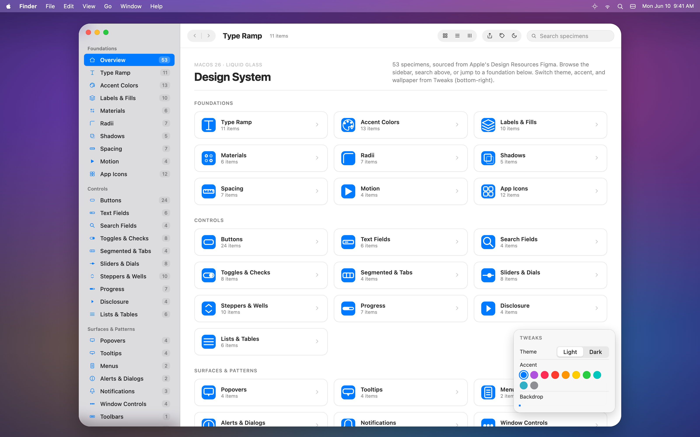

# macOS 26 Design System



**Ver demo interactivo:** [juanlara-aidev.github.io/macos-26-design/bundle/showcase.html](https://juanlara-aidev.github.io/macos-26-design/bundle/showcase.html)

Skill drop-in del Design System de **macOS 26** (Liquid Glass) para [Claude Code](https://code.claude.com), Cursor, Gemini CLI y cualquier agente compatible con [Agent Skills](https://platform.claude.com/docs/en/agents-and-tools/agent-skills/overview).

## Instalar

```bash
npx github:juanlara-aidev/macos-26-design
```

Auto-detecta `.claude/`, `.agents/` o `.gemini/`. Reinicia tu agente y menciona *"look macOS"* o *"Liquid Glass"* — se activa sola.

Más opciones: `npx github:juanlara-aidev/macos-26-design --help`.

## Qué hay dentro

Tokens (SF Pro · paleta de sistema · Liquid Glass · radii · shadows · motion), **53 specimens HTML**, un mesh gradient procedural como backdrop demo y mapa SF Symbols → Lucide. **Sin assets de Apple** — el bundle es 100% redistribuible.

## Fuente

Basado en el archivo Figma `macOS 26 (Community).fig` de Apple Design Resources. Empaquetado vía [Claude Design](https://claude.ai/design).

## Licencia

MIT — código, tokens y specimens (ver [LICENSE](LICENSE)). Las referencias a **SF Pro / SF Symbols** son propiedad de Apple, usadas únicamente por nombre vía fallback chain del sistema (no se bundlean).
