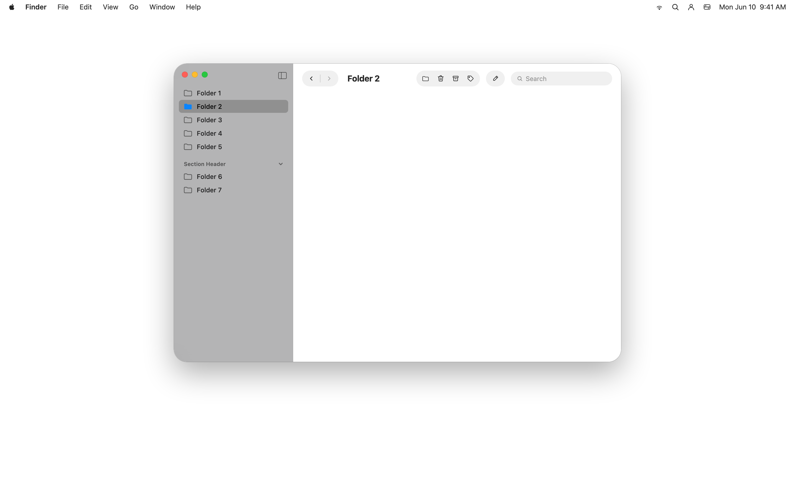

# macOS 26 Design System

Design System de **macOS 26** — la era Liquid Glass — empaquetado como skill drop-in para [Claude Code](https://code.claude.com), Cursor, Gemini CLI y cualquier agente compatible con [Anthropic Agent Skills](https://platform.claude.com/docs/en/agents-and-tools/agent-skills/overview). Tokens, 53 componentes en HTML, wallpapers y reglas de voz Apple en un solo comando.



## Instalar

```bash
npx github:juanlara-aidev/macos-26-design
```

Auto-detecta `.claude/`, `.agents/` o `.gemini/` en tu proyecto y mete la skill en `<esa-carpeta>/skills/macos-26-design/`. Reinicia tu agente, menciona *"look macOS"* o *"Liquid Glass"* y se activa sola.

## Qué incluye

- Tipografía **SF Pro** + jerarquía de labels por opacidad (no rampas grises).
- Materiales **Liquid Glass** — thin / regular / thick × light / dark, verificados contra el Figma oficial.
- Paleta de **8 colores de sistema** + radius **26 pt** para ventanas (la silueta firma de macOS 26).
- **53 specimens HTML** — uno por cada foundation, control, superficie y patrón.
- **4 wallpapers Apple** + cover para testear glass contra backdrops variados.
- Mapa **SF Symbols → Lucide** para targets no-Apple.
- Reglas de voz y copy estilo Apple (Title Case, ellipsis, sin emoji en chrome).

## Comandos

```bash
npx github:juanlara-aidev/macos-26-design                   # auto-detect
npx github:juanlara-aidev/macos-26-design --target=.agents  # forzar carpeta
npx github:juanlara-aidev/macos-26-design --global          # ~/.claude/skills/
npx github:juanlara-aidev/macos-26-design --dry-run         # preview, no instala
npx github:juanlara-aidev/macos-26-design --force           # sobrescribir
```

## Compatibilidad

| Agente | Carpeta destino |
|---|---|
| Claude Code (CLI + IDE) | `.claude/skills/macos-26-design/` |
| Cursor | referencia desde `.cursorrules` o `.cursor/rules/` |
| Gemini CLI | `.gemini/skills/macos-26-design/` |
| Codex CLI / Cline / Aider y otros | `.agents/skills/macos-26-design/` |
| claude.ai (web) | upload manual del bundle como Custom Skill |

Cualquier agente del estándar [Agent Skills](https://platform.claude.com/docs/en/agents-and-tools/agent-skills/overview) lo descubre.

## Fuente

Basado en el archivo Figma oficial **macOS 26 (Community).fig** de Apple Design Resources. Empaquetado como Agent Skill vía [Claude Design](https://claude.ai/design).

## Licencia

MIT para el código y los specimens (ver [LICENSE](LICENSE)). Las referencias a **SF Pro / SF Symbols / wallpapers** son propiedad de Apple — uso para mocks y prototipado, **no redistribuir** en productos publicados.
